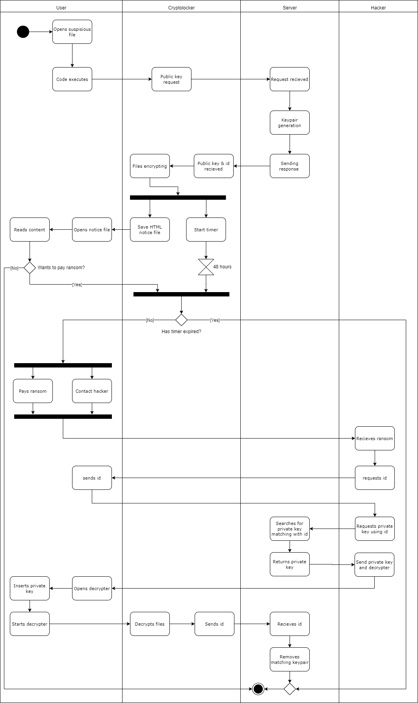

# Encryption Tool for Stage-Actwise Project

This project includes a set of Python scripts designed to encrypt files across a user's operating system while avoiding system-critical files that could cause the system to crash. It also includes a server component to handle the distribution of public keys and a client component that encrypts files and communicates with the server.

## Overview

The encryption tool is part of a cybersecurity project to demonstrate the effectiveness of the CyberArk Endpoint Privilege Manager (EPM) in defending against Cryptolocker-style ransomware attacks.

## How the ransomware works



## Components

The project consists of the following components:

- `server.py`: A Flask application that serves public keys and tracks encryption start times.
- `encrypt.py`: A script that encrypts files with specified extensions in user directories.
- `decrypt.py`: A script to decrypt previously encrypted files.
- `message.py`: A utility to generate and delete ransomware-style HTML message files. (This is a module, no need to use this only if you wish to adjust the ransomware message.)

## Server (`server.py`)

The Flask server provides two routes:
- `/publickey`: Serves the public RSA key for the encryption process.
- `/time/<id>`: Returns the time left before the encryption timer expires.

To handle cross-origin requests, the server implements CORS (Cross-Origin Resource Sharing) policy.

## Encryption Process (`encrypt.py`)

The encryption script operates as follows:
- Fetches the public key from the server.
- Encrypts files in the user's directories that match the specified extensions.
- Uses a ThreadPoolExecutor to encrypt files concurrently for efficiency.
- After encryption, the original files are securely deleted.

Supported file extensions and directories to encrypt are configurable.

## Decryption Process (`decrypt.py`)

The decryption script reverses the encryption process:
- Utilizes the corresponding private RSA key to decrypt the AES key.
- Decrypts the files with the AES key.
- Restores the original files and removes the encrypted versions.

## Message Utility (`message.py`)

The message utility handles the creation and deletion of a ransomware-style HTML message that includes a timer. It can fetch the remaining time from the server API to update the countdown timer displayed to the user.

## Usage

To use the encryption tool, follow these steps:
1. Start the Flask server (`server.py`).
2. Run the encryption script (`encrypt.py`) to encrypt files.
3. To decrypt files, use the decryption script (`decrypt.py`).

The scripts should be used in a controlled environment for demonstration purposes only.

## Dependencies

- Python 3.6+
- Flask
- `cryptography` package
- `requests` package
- `flask-cors` package for development
- `tkinter` for UI
- `pytz` & `datetime` for timer
- `webbrowser` for opening browser

## Installation

To set up the project environment:

1. Clone the repository:
    ``` cli
    git clone https://github.com/JelleFirlefyn/stage-actwise.git
    ```
1. Navigate to the `encry-ransomware/server` directory.
1. Install required Python packages:
    ```
    pip install -r requirements.txt
    ``` cli
1. Navigate to the `encry-ransomware/cryptolocker` directory.
1. Install required Python packages:
    ``` cli
    pip install -r requirements.txt
    ```
1. In the encrypt.py file, adjust the SERVER and PORT variable to your needs.
    ``` python
    SERVER="10.0.0.1"
    PORT="5050"
    ```

## Running the Server

To start the server on your local machine (adjust port if needed)
```
cd encry-ransomware/server
flask run --host=0.0.0.0 --port=5050
```

## Encrypting Files

To encrypt files:
```
cd encry-ransomware
python encrypt.py
```

### GUI

To create a executable for encrypting on Windows:
 1. ```pip install pyinstaller```
 1. ```python -m PyInstaller --onefile --noconsole encrypt.py```
 You can use the --icon=icon.ico option with PyInstaller to specify a custom icon for the executable.

Executable will be available in the dist folder.


## Decrypting Files

To decrypt your files:
```
cd encry-ransomware
python decrypt.py
```

### GUI

To create a executable for encrypting on Windows:
 1. ```pip install pyinstaller```
 1. ```python -m PyInstaller --onefile --noconsole decrypt-ui.py```
 You can use the --icon=icon.ico option with PyInstaller to specify a custom icon for the executable.

Executable will be available in the dist folder.

## Notes

- Do NOT use this tool on any system without explicit authorization.
- Do NOT run the server and encrypter on the same machine.
- Always back up important files before running encryption or decryption scripts.
- This tool is for educational purposes to simulate an attack in a controlled environment.
